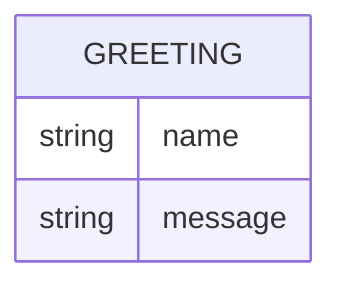

# Domain Model

Greeter has no persisted state — every request is answered from the input alone. The single conceptual entity below exists only in-flight, as the shape of a response, and is never stored.

`GREETING` is the response shape returned by `GET /hello`: `name` is the value supplied in the query string (or absent when none was given), and `message` is the greeting text built from it.